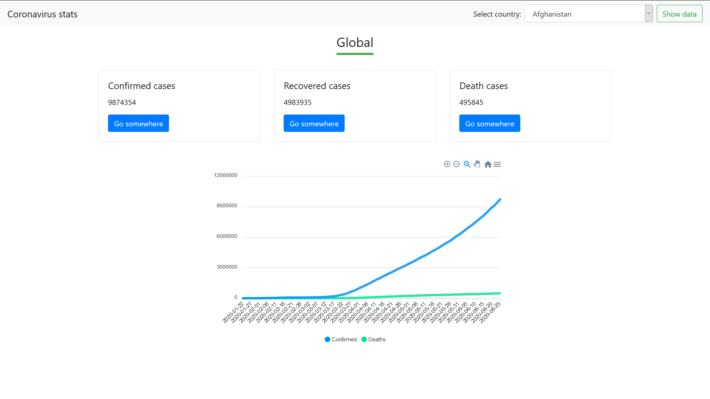

# flask-project2
This is my second practice project made in Flask. The idea was to tackle working with external API (https://covid19.mathdro.id/api) in this framework. 
Also, this app uses Bootstrap 4 and ApexCharts.js. 

## Screenshot: 

 

